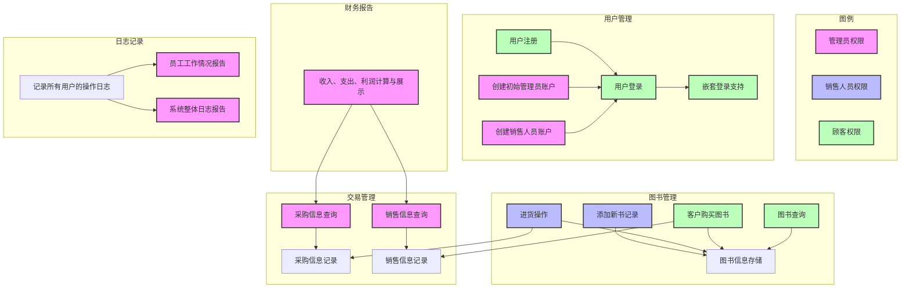
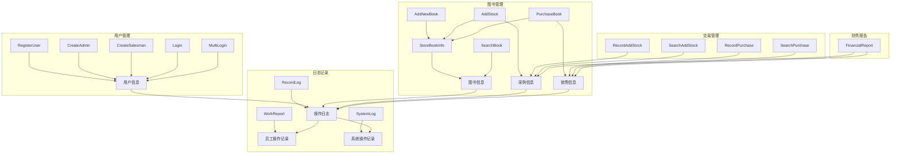

# 书店需求分析文档

## 业务流图

我使用Mermaid绘制了业务流图，如下所示：

导出的图片见[业务流图](业务流图.svg)

## 数据流图

我使用Mermaid绘制了数据流图，如下所示：

导出的图片见[数据流图](数据流图.svg)

## 数据词典

- 用户信息：struct User
    - 用户名 std::string UserName
    - 密码 std::string Password
    - 权限 （0：顾客，1：销售人员，2：店长）enum Permission

- 图书信息：struct Book
    - ISBN std::string ISBN
    - 书名 std::string Name
    - 作者 std::string Author
    - 关键字 std::string Keyword
    - 库存 int Stock
    - 单价 double Price

- 采购信息：struct AddStockRecord
    - ISBN std::string ISBN
    - 数量 int Amount
    - 单价 double Price

- 销售信息：struct PurchaseRecord
    - ISBN std::string ISBN
    - 数量 int Amount
    - 单价 double Price

- 操作日志：class Log
    - 操作类型 enum OperationType
    - 操作人员 std::string Operator

    - 员工操作记录：class WorkRecord : public Log
        - 操作类型 enum OperationType
        - 操作人员 std::string Operator
        - 操作对象 std::string Object

    - 系统操作记录：class SystemRecord : public Log
        - 操作类型 enum OperationType
        - 操作人员 std::string Operator
        - 操作对象 std::string Object
        - 操作返回值 std::string Result

- 财务报告：struct FinancialReport
    - 收入 double Income
    - 支出 double Expense

## 功能说明

1. **用户管理**
    - 用户注册（游客）
     
        - 模块名称：RegisterUser
        - 功能描述：用户注册
        - 输入：用户名、密码、权限（默认0）
        - 输出：注册成功/失败（返回错误信息）
        - 处理：检查用户名是否已存在，若不存在则注册成功，否则注册失败

    - 创建初始管理员账户（店长）
     
        - 模块名称：CreateAdmin
        - 功能描述：创建初始管理员账户
        - 输入：用户名、密码、权限（默认2）

    - 创建销售人员账户（店长）
     
        - 模块名称：CreateSalesman
        - 功能描述：创建销售人员账户
        - 输入：用户名、密码、权限（默认1）
        - 输出：创建成功/失败
        - 处理：检查用户名是否已存在，若不存在则创建成功，否则创建失败

    - 用户登录（游客、顾客、销售人员、店长）
        
        - 模块名称：Login
        - 功能描述：用户登录
        - 输入：用户名、密码
        - 输出：登录成功/失败
        - 处理：检查用户名密码是否匹配，若匹配则登录成功，否则登录失败

    - 嵌套登录支持（允许多个账户同时登录）

        - 模块名称：MultiLogin
        - 处理：输入的指令视为最后登录的帐户操作

2. **图书管理**
    - 图书信息存储（ISBN、书名、作者、关键字、库存、单价）

        - 模块名称：StoreBookInfo
        - 功能描述：图书信息存储
        - 输入：ISBN、书名、作者、关键字、库存、单价（这些参数的任意组合）
        - 输出：存储成功/失败
        - 处理：修改已有图书信息；验证输入信息是否合法，若合法则存储成功，否则存储失败

    - 添加新书记录（依托于StoreBookInfo）

        - 模块名称：AddNewBook
        - 功能描述：添加新书记录
        - 输入：ISBN、书名、作者、关键字、库存、单价
        - 输出：添加成功/失败
        - 处理：要求**输入完整信息**，调用StoreBookInfo，若没有输入完整信息则添加失败

    - 进货操作（销售人员）（依托于StoreBookInfo）

        - 模块名称：AddStock
        - 功能描述：进货操作
        - 输入：ISBN、数量、进货价格
        - 输出：进货成功/失败
        - 处理：修改库存量，记录进货信息，同时调用RecordAddStock记录采购信息

    - 客户购买图书（顾客）（依托于StoreBookInfo）

        - 模块名称：PurchaseBook
        - 功能描述：客户购买图书
        - 输入：ISBN、数量
        - 输出：购买成功/失败
        - 处理：检查库存量是否足够，若足够则购买成功，且调用StoreBookInfo减少库存量，调用RecordPurchase记录销售信息。否则购买失败

    - 图书查询（多条件组合）
    
        - 模块名称：SearchBook
        - 功能描述：图书查询
        - 输入：ISBN、书名、作者、关键字的任意组合
        - 输出：查询结果
        - 处理：根据输入条件查询图书信息

3. **交易管理**
    - 采购信息记录

        - 模块名称：RecordAddStock
        - 功能描述：采购信息记录
        - 输入：ISBN、数量、单价
        - 输出：void

    - 销售信息记录

        - 模块名称：RecordPurchase
        - 功能描述：销售信息记录
        - 输入：ISBN、数量、单价
        - 输出：void

    - 采购信息查询（店长）

        - 模块名称：SearchAddStock
        - 功能描述：采购信息查询
        - 输入：时间段
        - 输出：采购信息
        - 处理：根据时间段查询采购信息

    - 销售信息查询（店长）
    
        - 模块名称：SearchPurchase
        - 功能描述：销售信息查询
        - 输入：时间段
        - 输出：销售信息
        - 处理：根据时间段查询销售信息

4. **财务报告**
    - 收入、支出、利润计算与展示（店长）

        - 模块名称：FinancialReport
        - 功能描述：收入、支出、利润计算与展示
        - 输入：时间段
        - 输出：收入、支出、利润
        - 处理：根据时间段查询采购信息和销售信息，计算收入、支出、利润

5. **日志记录**
    - 记录所有用户的操作日志（全局）

        - 模块名称：RecordLog
        - 功能描述：记录所有用户的操作日志
        - 输入：操作类型、操作对象
        - 输出：void
    
    - 员工工作情况报告（店长）

        - 模块名称：WorkReport
        - 功能描述：员工工作情况报告
        - 输入：时间段
        - 输出：员工操作记录
        - 处理：根据时间段查询员工操作记录

    - 系统整体日志报告（店长）

        - 模块名称：SystemLog
        - 功能描述：系统整体日志报告
        - 输入：时间段
        - 输出：系统操作记录
        - 处理：根据时间段查询系统操作记录

## 用户交互设计

1. **用户管理**
    - 用户注册（游客）
        - 输入：register <UserName> <Password>
        - 输出：注册成功/失败

    - 创建初始管理员账户（店长）（程序启动时调用）
        - 提示：“Admin account not found, please create one.”
        - 输入：<UserName> <Password>
        - 输出：创建成功/失败

    - 创建销售人员账户（店长）
        - 输入：createSalesman <UserName> <Password>

    - 用户登录（游客、顾客、销售人员、店长）
        - 输入：login <UserName> <Password>
    
2. **图书管理**
    - 添加新书记录
        - 输入：addNewBook <ISBN> <Name> <Author> <Keyword> <Stock> <Price>
        - 输出：添加成功/失败

    - 进货操作（销售人员）
        - 输入：addStock <ISBN> <Amount> <Price>
        - 输出：进货成功/失败

    - 客户购买图书（顾客）
        - 输入：purchase <ISBN> <Amount>
        - 输出：购买成功/失败

    - 图书查询（多条件组合）
        - 输入：searchBook <ISBN> <Name> <Author> <Keyword>
        - 输出：查询结果

3. **交易管理**
    - 采购信息查询（店长）
        - 输入：queryStock <Time>
        - 输出：采购信息

    - 销售信息查询（店长）
        - 输入：queryPurchase <Time>
        - 输出：销售信息
    
4. **财务报告**
    - 收入、支出、利润计算与展示（店长）
        - 输入：financialReport <Time>
        - 输出：收入、支出、利润

5. **日志记录**
    - 员工工作情况报告（店长）
        - 输入：workReport <Time>
        - 输出：员工操作记录

    - 系统整体日志报告（店长）
        - 输入：systemLog <Time>
        - 输出：系统操作记录